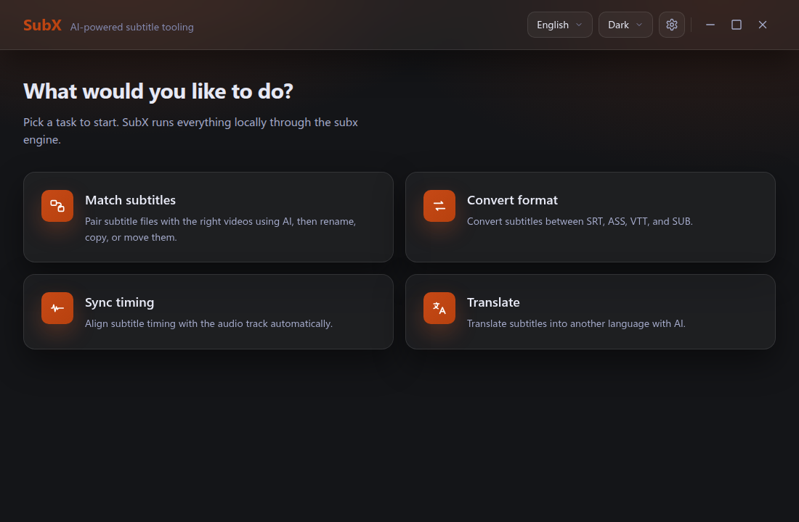
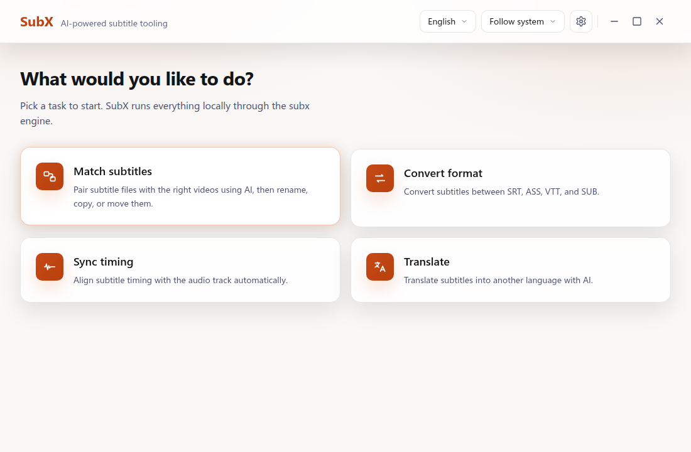
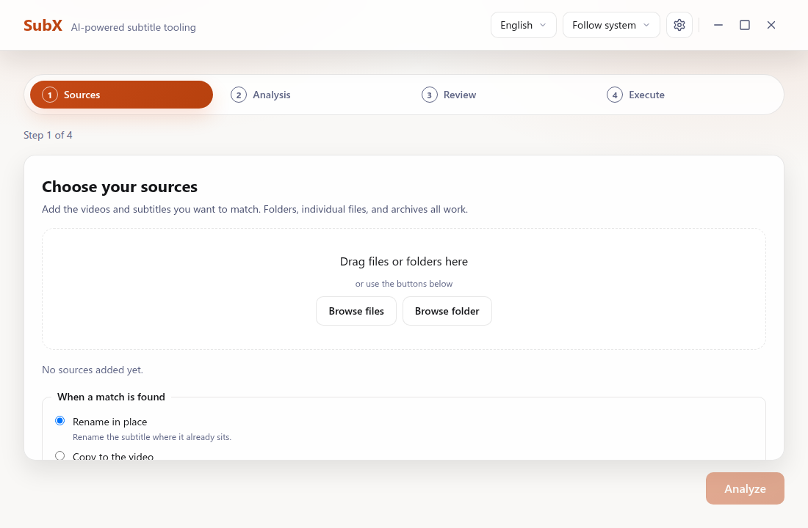
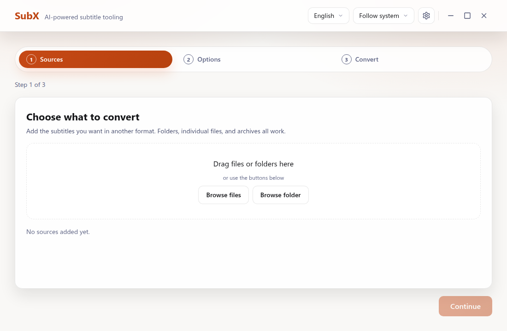
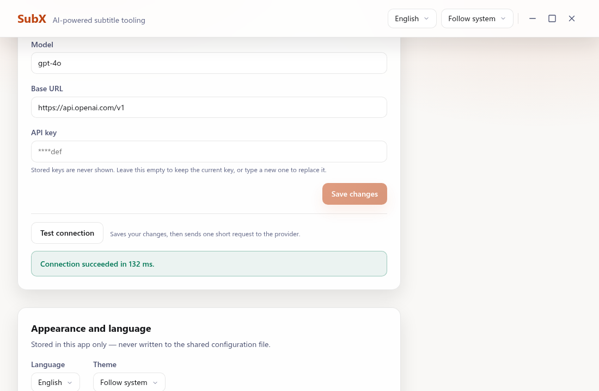

<div align="center">

  

  # SubX

  **AI-powered subtitle tooling**

  Desktop GUI for [subx-cli](https://github.com/jim60105/subx-cli) — subtitle matching, format conversion, synchronization, and translation.

  [](https://github.com/jim60105/subx/actions/workflows/ci.yml) [](https://codecov.io/gh/jim60105/subx)

  English | [中文](./README.zh-TW.md)

</div>

## What SubX Does

SubX provides a desktop graphical user interface for [subx-cli](https://github.com/jim60105/subx-cli), bringing AI-powered subtitle operations to desktop users while referencing the underlying CLI for power users who prefer scripting and automation.

The application includes the following core capabilities:

- **Match wizard**: Match subtitles to video files using AI analysis with a drag-and-drop interface.
- **Convert wizard**: Perform batch format conversion across SRT, ASS, VTT, and SUB files.
- **Settings panel**: Configure AI providers, perform connection testing, adjust theme preferences (light, dark, system), and set language options.

Features for subtitle synchronization (Sync wizard) and translation (Translate wizard) are planned for upcoming releases.

## Screenshots

<!-- screenshot: home screen (dark) -->


<!-- screenshot: home screen -->


<!-- screenshot: match wizard -->


<!-- screenshot: convert wizard -->


<!-- screenshot: settings panel -->


## Download

Pre-built installation packages for SubX are available on the [GitHub Releases](https://github.com/jim60105/subx/releases) page. Each release contains artifacts for supported desktop operating systems:

- **Linux (x86_64, arm64)**: `.AppImage`, `.deb`, and `.tar.gz` bundles.
- **macOS (Apple Silicon arm64, Intel x86_64)**: `.dmg` disk images and `.app.tar.gz` archives.
- **Windows (x86_64)**: `.msi` installers and standalone `.exe` setup packages.

### System Requirements & Installation Caveats

Linux releases require `glibc` 2.39 or higher (found in Ubuntu 24.04+, Debian 13+, Fedora 40+, or equivalent modern distributions). Users on older distributions should follow the [Building from Source](#building-from-source) section below.

SubX distribution packages are unsigned. Operating systems will present standard security prompts on initial launch:

- **macOS Gatekeeper**: If macOS reports that the application is damaged and cannot be opened, remove the quarantine attribute with:
  ```bash
  xattr -dr com.apple.quarantine /Applications/SubX.app
  ```
- **Windows SmartScreen**: Click **More info** on the SmartScreen dialog, then select **Run anyway**.
- **Build Provenance**: You can independently verify any downloaded asset against GitHub Actions build provenance attestations by running:
  ```bash
  gh attestation verify <file> --repo jim60105/subx
  ```

## Building from Source

### Prerequisites

Building SubX requires:

- Node Current LTS (or higher)
- Rust stable toolchain
- Linux system dependencies: `libwebkit2gtk-4.1-dev`, `libappindicator3-dev`, `librsvg2-dev`, `patchelf`, `libgtk-3-dev`

### Build Commands

```bash
# Install dependencies
npm install

# Run application in development mode
npm run tauri dev

# Build production bundle
npm run tauri build
```

## Supported Formats

| Format | Read | Write | Notes |
|--------|------|-------|-------|
| SRT | ✅ | ✅ | SubRip — most widely supported |
| ASS | ✅ | ✅ | Advanced SubStation Alpha — rich styling |
| VTT | ✅ | ✅ | WebVTT — web-native format |
| SUB | ✅ | ⚠️ | Multiple SUB variants, partial write support |

## AI Provider Support

SubX shares configuration with [subx-cli](https://github.com/jim60105/subx-cli) at `~/.config/subx/config.toml`. Supported AI providers include:

- OpenAI
- OpenRouter
- Azure OpenAI
- Local LLMs (Ollama, LM Studio, llama.cpp, vLLM)

For detailed provider configuration options and environment variable setups, refer to the [subx-cli configuration guide](https://github.com/jim60105/subx-cli/blob/master/docs/configuration-guide.md).

## Internationalization

SubX is available in English and Traditional Chinese (正體中文), featuring automatic system language detection to match your operating system settings.

## Development

SubX follows spec-driven development using OpenSpec. There is no pull-request flow; continuous integration runs on push events, making local verification your primary defense.

Run the verification suite using:

```bash
npm run verify
```

The verification process enforces four mandatory gates:

1. Type-check (`tsc --noEmit`)
2. Frontend code coverage (Vitest ≥ 85%)
3. Backend code coverage (`cargo cov` ≥ 85%)
4. Spec traceability (`npm run spec:trace`) and IPC bindings drift check (`npm run bindings:check`)

For comprehensive details on verification procedures, refer to [docs/verification.md](docs/verification.md).

## Tech Stack

- **Framework**: Tauri 2
- **Frontend**: React 18, TypeScript, Vite 7
- **Backend**: Rust, `subx-cli` crate

## Related Projects

- [subx-cli](https://github.com/jim60105/subx-cli) — AI-powered CLI for subtitle matching, renaming, format conversion, and timeline correction.

## License

### GPLv3


[GNU GENERAL PUBLIC LICENSE Version 3](LICENSE)

Copyright (C) 2025 Jim Chen <Jim@ChenJ.im>.

This program is free software: you can redistribute it and/or modify it under the terms of the GNU General Public License as published by the Free Software Foundation, either version 3 of the License, or (at your option) any later version.

This program is distributed in the hope that it will be useful, but WITHOUT ANY WARRANTY; without even the implied warranty of MERCHANTABILITY or FITNESS FOR A PARTICULAR PURPOSE. See the GNU General Public License for more details.

You should have received a copy of the GNU General Public License along with this program. If not, see [https://www.gnu.org/licenses/](https://www.gnu.org/licenses/).
