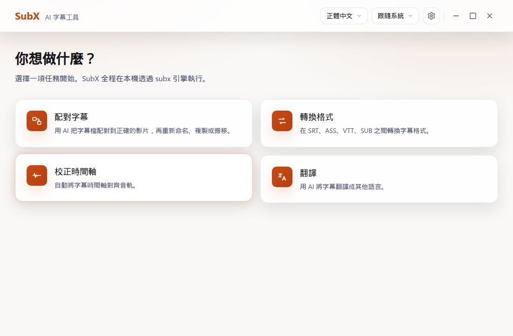
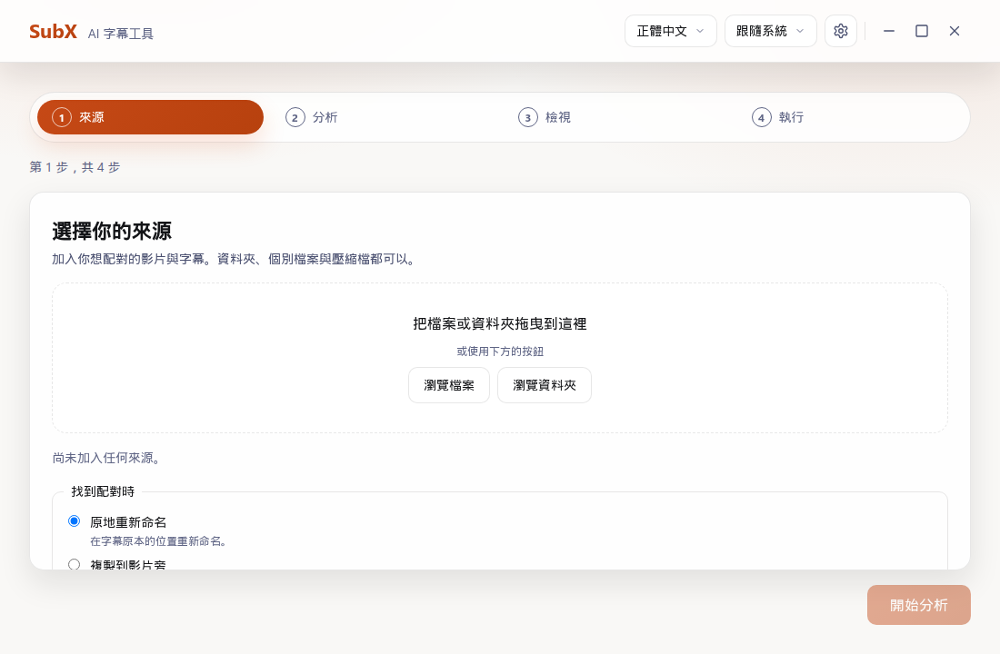
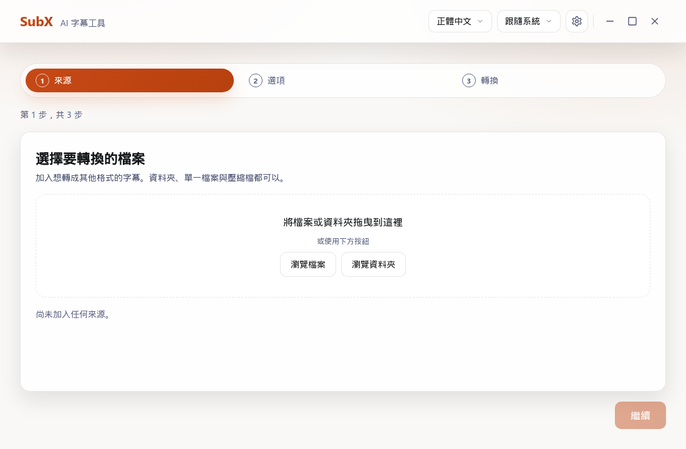
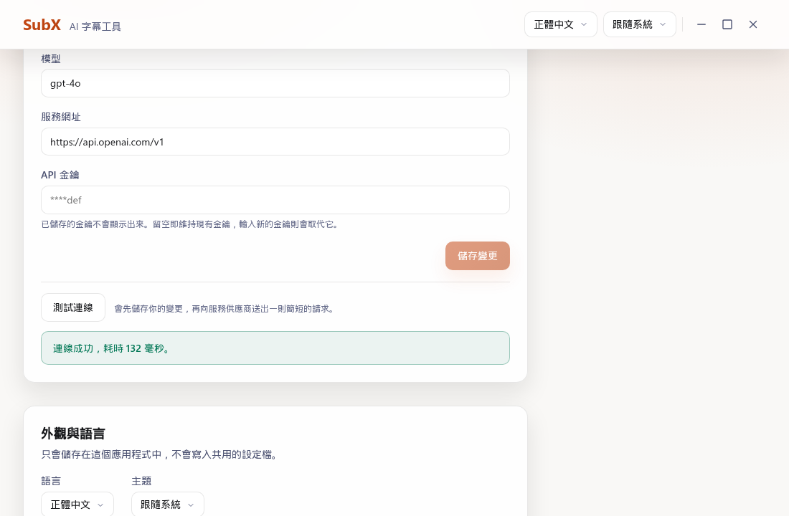

<div align="center">

# SubX

[](https://github.com/jim60105/subx/actions/workflows/ci.yml) [](https://codecov.io/gh/jim60105/subx)

[English](./README.md) | 中文

[subx-cli](https://github.com/jim60105/subx-cli) 的桌面 GUI — AI 驅動的字幕配對、轉換、同步與翻譯。

</div>

## SubX 能做什麼

SubX 為 [subx-cli](https://github.com/jim60105/subx-cli) 提供桌面圖形使用者介面，將 AI 驅動的字幕操作帶給桌面端使用者，偏好腳本與自動化的使用者亦可參考底層 CLI 工具。

應用程式包含下列核心功能：

- **配對精靈** — 運用拖放介面與 AI 分析，進行字幕與影片檔案的比對。
- **轉換精靈** — 支援 SRT、ASS、VTT 與 SUB 檔案之間的批次格式轉換。
- **設定面板** — 提供 AI 供應商設定、連線測試、主題偏好設定（淺色、深色、系統預設）以及語言選項。

字幕同步（同步精靈）與翻譯（翻譯精靈）功能規劃於後續版本推出。

## 螢幕截圖

<!-- screenshot: home screen -->


<!-- screenshot: match wizard -->


<!-- screenshot: convert wizard -->


<!-- screenshot: settings panel -->


## 下載

SubX 的預建安裝套件發布於 [GitHub Releases](https://github.com/jim60105/subx/releases) 頁面。每個版本皆提供支援桌面作業系統的發行檔案：

- **Linux (x86_64, arm64)** — `.AppImage`、`.deb` 與 `.tar.gz` 套件。
- **macOS (Apple Silicon arm64, Intel x86_64)** — `.dmg` 磁碟影像檔與 `.app.tar.gz` 封存檔。
- **Windows (x86_64)** — `.msi` 安裝程式與 `.exe` 安裝檔。

### 系統需求與安裝說明

Linux 版本需要 `glibc` 2.39 或更高版本（適用於 Ubuntu 24.04+、Debian 13+、Fedora 40+ 或同等新版發行版）。使用較舊版本發行版的作業系統，請參考下方的[從原始碼建構](#從原始碼建構)章節。

SubX 發行套件未進行數位簽署，作業系統會在首次啟動時顯示標準安全提示：

- **macOS Gatekeeper** — 若 macOS 顯示應用程式已損毀且無法開啟的提示，請執行下列命令移除隔離屬性：
  ```bash
  xattr -dr com.apple.quarantine /Applications/SubX.app
  ```
- **Windows SmartScreen** — 在 SmartScreen 對話框中按一下**更多資訊**，接著選擇**仍要執行**。
- **建構來源驗證** — 你可以使用 GitHub CLI 驗證下載檔案的 GitHub Actions 建構來源證明：
  ```bash
  gh attestation verify <file> --repo jim60105/subx
  ```

## 從原始碼建構

### 先決條件

建構 SubX 需要下列環境與套件：

- Node Current LTS 或更高版本
- Rust 穩定版工具鏈
- Linux 系統相依套件 — `libwebkit2gtk-4.1-dev`、`libappindicator3-dev`、`librsvg2-dev`、`patchelf`、`libgtk-3-dev`

### 建構命令

```bash
# 安裝相依套件
npm install

# 以開發模式執行應用程式
npm run tauri dev

# 建構正式發行套件
npm run tauri build
```

## 支援格式

| 格式 | 讀取 | 寫入 | 說明 |
|------|------|------|------|
| SRT | ✅ | ✅ | SubRip，最廣泛支援的格式 |
| ASS | ✅ | ✅ | Advanced SubStation Alpha，豐富的樣式功能 |
| VTT | ✅ | ✅ | WebVTT，網頁原生格式 |
| SUB | ✅ | ⚠️ | 多種 SUB 變體，部分寫入支援 |

## AI 供應商支援

SubX 與 [subx-cli](https://github.com/jim60105/subx-cli) 共享位於 `~/.config/subx/config.toml` 的設定檔案。支援的 AI 供應商包含：

- OpenAI
- OpenRouter
- Azure OpenAI
- 本地 LLM（Ollama、LM Studio、llama.cpp、vLLM）

詳細的供應商設定選項與環境變數設定，請參閱 [subx-cli 設定指南](https://github.com/jim60105/subx-cli/blob/master/docs/configuration-guide.md)。

## 國際化

SubX 支援英文與正體中文，並能自動偵測系統語言以符合你的作業系統設定。

## 開發

SubX 採用 OpenSpec 規格驅動開發。專案不使用 PR 工作流程，持續整合會在推送事件觸發，本機驗證是你的主要防線。

執行驗證測試集：

```bash
npm run verify
```

驗證流程包含四大門檻：

1. 型別檢查（`tsc --noEmit`）
2. 前端程式碼覆蓋率（Vitest ≥ 85%）
3. 後端程式碼覆蓋率（`cargo cov` ≥ 85%）
4. 規格可追蹤性（`npm run spec:trace`）與 IPC 綁定漂移檢查（`npm run bindings:check`）

完整的驗證程序說明請參閱 [docs/verification.md](docs/verification.md)。

## 技術堆疊

- **框架** — Tauri 2
- **前端** — React 18、TypeScript、Vite 7
- **後端** — Rust、`subx-cli` crate

## 相關專案

- [subx-cli](https://github.com/jim60105/subx-cli) — 用於字幕配對、重新命名、格式轉換與時間軸校正的 AI 驅動 CLI 工具。

## 授權條款

### GPLv3


[GNU GENERAL PUBLIC LICENSE Version 3](LICENSE)

Copyright (C) 2025 Jim Chen <Jim@ChenJ.im>.

本程式為自由軟體，你可以依據由自由軟體基金會發布的 GNU 通用公共授權條款（第 3 版，或你選擇的任何後續版本）重新發佈及／或修改本程式。

本程式以期望其有用而發佈，但不提供任何保證；甚至不包含對適銷性或特定用途適用性的默示保證。詳情請參閱 GNU 通用公共授權條款。

你應已隨本程式收到一份 GNU 通用公共授權條款副本。如果沒有，請參見 <https://www.gnu.org/licenses/>。
